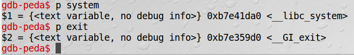
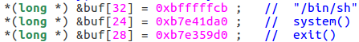
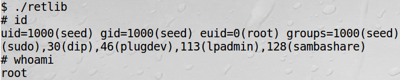
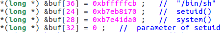
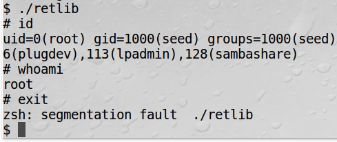
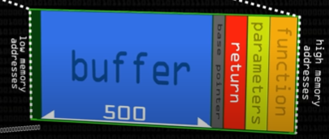
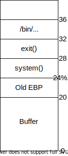
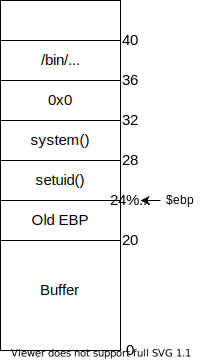

# Return-to-Libc-seedlab
Return to Libc attack solution and explanation for seed lab

### Setup:

- Ubuntu and several other Linux-based systems use address space randomization to randomize the starting address of heap and stack, making guessing the exact addresses difficult. We can disable this feature using command `sudo sysctl -w kernel.randomize_va_space=0`
- The GCC compiler implements a security mechanism called StackGuard to prevent buffer overflows. In the presence of this protection, buffer overflow attacks do not work. We can disable this protection during the compilation using the `-fno-stack-protector` option.
- Because the objective of this lab is to show that the non-executable stack protection does not work, we should always compile your program using the `-z noexecstack` option for retlib.c file.
- We use the command `sudo ln -sf /bin/zsh /bin/sh` to link /bin/sh to zsh because we can not leave sh linked to dash since /bin/dash immediately drops the Set-UID privilege before executing our command, making our attack more difficult.

### Task 1: Finding out the addresses of libc functions:
 
- `gcc -fno-stack-protector -z noexecstack -o retlib retlib.c` this command compiles retlib.c. After it is compiled we need to change the owner of the file to root using command  `sudo chown root retlib` then make it executable using command  `sudo chmod 4755 retlib`
- Now we need to create a badfile with whatever content we like or maybe leave it empty. 
- Next we can run gdb compiler on retlib using command `gdb -q retlib`
- Now that we are inside gdb, we need to run the program using command `run`
- Now we can get the address of system() and exit() using command `p system` and `p exit` respectively.



### Task 2: Putting the shell string in the memory 

- Our attack strategy is to jump to the system() function and get it to execute an arbitrary command.
- Since we want the shell prompt, we want the system() function to execute the “/bin/sh” program.
- For that, we need to place /bin/sh into the memory and know its address so that it can be passed to the system() function.
- We can define a new variable MYSHELL and let it contain the string /bin/sh using command `export MYSHELL=/bin/sh`.
- We will use the address of MYSHELL as the argument to the system() call. The following program gives the location of MYSHELL. 

```c
void main(){ 
  char* shell = (char *) getenv("MYSHELL"); 
  if (shell) 
    printf("%x\n", (unsigned int)shell); 
}
On compiling and running the above program, we get the address of /bin/sh.
```

### Task 3: Exploiting the buffer-overflow vulnerability

- Now we have addresses of system(), exit() and /bin/sh.
- We can place these addresses in the exploit.c program. 
- Now we need to find the value of X, Y and Z.
- When I placed 20 A’s in badfile, it returned properly. But when placed 21 A’s, it returned but gave segmentation fault. And we know that segmentation fault occurs when there is buffer overflow. Since the addresses are 4 bytes long, we know that the return address now is at 24 position. So value of Y in exploit.c is 24.
- And according to the above explanation, $ebp points to 20 and parameter of system() should be at offset of 8 from $ebp. So /bin/sh’s address should be at 28 29 30 and 31. Making the value of X = 32 in exploit.c
- Next we know that, return address is exactly below the parameter. So exit() should be at 24 25 26 and 27 making the value of Z = 28 in exploit.c.
- Now we have everything that we need. Value of X, Y and Z and address of /bin/sh, system() and exit(). 



- Now we are ready to compile exploit.c as exploit using command gcc -o exploit exploit.c. On running ./exploit, we get the badfile that would make the attack successful. Now we can run ./retlib and this gives us roots’s shell.



### Task 4: Turning on address randomization

- We can turn on the address randomization using command `sudo sysctl -w kernel.randomize_va_space=2`
- This time ./retlib gives segmentation fault. This is because buffer overflow occurred but address of system(), exit() and /bin/sh varied every time. So we can not get a hold on for an exact address. This is why attack was not successful.
- The Values of X, Y and Z do not change, only their addresses change.

### Task 5: Defeat Shell’s countermeasure
- For this task, we have to first turn off the address randomization. And then link /bin/sh to /bin/dash using command sudo ln -sf /bin/dash /bin/sh
- Some shell programs, such as dash and bash, have a countermeasure that automatically drops privileges when they are executed in a Set-UID process.
- So with /bin/sh linked to /bin/dash, we can not execute the earlier exploit.
- On running ./retlibi, a shell is executed but that is not root’s shell. 
- To solve this, we need to call setuid(0) before calling the system() function.
- We can get the address of setuid() from gdb just like how we got the address of system() and exit(). On gdb, we can run p setuid to get the address of setuid().
- Now, we know that the parameter of setuid() should be at address $ebp + 8. Now that ebp points to 20, parameter, 0  should be at 28 29 30 and 31 address making buf[32] = 0. We are particularly taking 0 as parameter because uid=0 represents the root user.



- What happens here is, at 24, setuid() gets called, its parameter is at offset of 8, i.e. 32. Then, the return address becomes 28 where we can call system() whose parameter would be at an offset of 8, i.e. 36.
- On doing this, I got the root privilege. Now that, return address of system(), buf[32] is replaced by 0, parameter of setuid(), there is no place for exit(). This is why it returns a segmentation fault when we exit the root shell. 



## Desctiption

### Return to Libc attack:

A "return-to-libc" attack is a computer security attack usually starting with a buffer overflow in which a subroutine return address on a call stack is replaced by an address of a subroutine that is already present in the process’ executable memory, bypassing the no-execute bit feature (if present) and ridding the attacker of the need to inject their own code.

### Functions:

- **Libc** system(): The system() function is a part of the C/C++ standard library. It is used to pass the commands that can be executed in the command processor or the terminal of the operating system, and finally returns the command after it has been completed.
- exit(): The C library function void exit(int status) terminates the calling process immediately.
- **gLibc** setuid(): This function when run will parameter 0, gives privileges from the user 0, i.e. root.

### Explanation:

- The picture shown here is the general structure of stack when a function call happens. During a function call, a stack memory gets allocated with sections: function, parameters of function, return address, EBP pointer and buffer from high memory address to low memory address.



- When we send data longer than the allocated buffer size, it gets overwritten to EBP and then Return Address and slowly to the high memory address. This is called buffer overflow. 
- When the buffer reaches the Return address, we get **Segmentation fault**.
- When we run buffer-overflow, we have to execute a shellcode so the stack is executable.
- But this time, our challenge is to exploit the program with a **non executable stack**. So, we have to run a function that is already in the memory when a particular program is executed. And that function should be able to spawn a shell as root.
- With C, there is a function, system() which belongs to Libc. On execution of a C program, some functions get loaded into the memory. Among them system() is the one which can spawn a shell.
- We also need to connect /bin/sh to /bin/zsh because the countermeasure in /bin/dash immediately drops the Set-UID privilege before executing our command, making our attack more difficult.
- If we compile and run retlib.c with a blank badfile, we will notice that it returns properly.
- *With 20 characters in it, it returns properly. When there are 21 characters in badfile, it returns properly and also gives segmentation fault. This says that buffer overflow has occurred and they have overwritten the EBP address.
- *And upto 24 characters, it returns properly with segmentation fault. But when there are 25 characters, it does not return properly and only gives segmentation fault. Until 24 characters, Return Address was not touched with the buffer overflow. But when it became 25, it erased the Return Address. So there is nowhere to go in order to end the program. This is why it does not return properly.
- Because it overwrites the return address when there are 25 characters, we know that the address of Return address is 24 more than the buffer address. Since addresses are 4 byte long, Return address is in **buffer address + 24, 25, 26 and 27** memory addresses.
- Now, to conduct this attack, we need to replace the Return address with the address of the system() function with which we will spawn a shell. So, **buf[24] = address of system()**.
- To get this address, we need to create a badfile with length of characters less than 21. And run gdb on retlib. After running the program in gdb, we can print the address of the system using `p system`.
- When buffer overflow occurs, **stack pointer(ESP)** reaches the address of system() (i.e. $esp = 24 + buffer address) and hence **jumps** to system(). Because it is jumping, it does not allocate a separate stack for its operation, that's why we need to specify the return address of system() and parameter address by yourself. 
- When control jumps to system(), 2 events occur: first, it pushes the address where $ebp is pointing to location just below it, in our case 20, 21, 22 and 23; Second, it moves $ebp pointer to where $esp is pointing at, in our case 24+buffer_address. So ultimately, **$ebp = 24** + buffer address.
- Now we have jumped to system() but we need to pass the parameter, /bin/sh to this system. And according to the structure of stack, **address of parameter = $ebp + 8**. So parameter /bin/sh should be at buffer address + 32. Hence **buf[32] = address of /bin/sh**.



- Now we need to know the address of /bin/sh. For that, the lab suggests to create a new shell variable and place /bin/sh string in that variable. According to the program it has provided, we can get the address of /bin/sh once we run the program. 
- And we know the return address is $ebp + 4. So exit() will be at 28. If there is no exit() specified, it returns segmentation fault. Hence **buf[28] = address of exit()**. This address can be found similar to system() address in gdb. 
- There is everything set now. 
- Now when the program retlib runs, buffer overflow occurs. When the stack pointer reaches the Return address, it executes the system() function. Its parameter is taken as /bin/sh whose address is placed at 32, 33, 34 and 35 in the badfile (we get the badfile once we compile exploit.c with the above edits). 
- But because relib is owned by root (if we follow the lab properly), we will get the root’s shell.
- And when we want to return from system() function, we will be directed to exit() function placed at 28, 29, 30 and 31.

<br>

- Next, when we want to execute this attack when /bin/sh is linked to /bin/dash, we can call **setuid(0)** which makes the uid = 0 (root) and then when we execute system(), it will be executed as root. 



- This time instead of system(), at buf[24], we need to jump to setuid. Now that the ebp is at 24, to send 0 as parameter of setuid(), we need to place 0 at buf[32].
- And then the return address of this function should be at buf[28] so that system() gets called after setuid() ends. Now, for system(), its parameter should be at 36 ($ebp + 8 = 28 + 8). $ebp = 8 because when control moves to system(), ESP points to 28. And when system() gets executed, EBP points to the location of ESP, 28.
- This way, we can get the root access with /bin/dash also.
- But because the return address of system() is expected to be at 32, but 0 is at 32, when we return from the shell, it gives segmentation fault because it does not find the return address.
